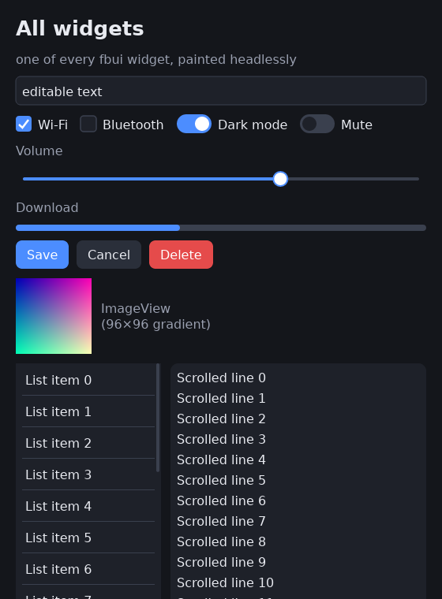
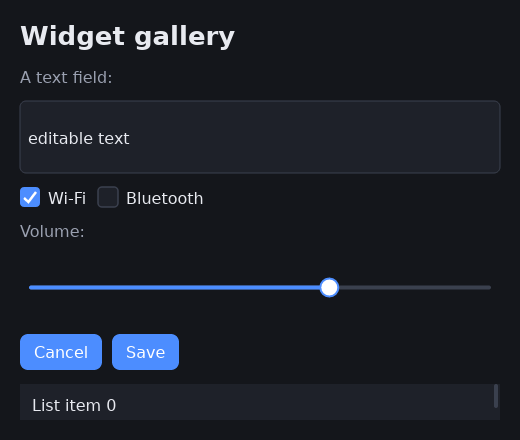
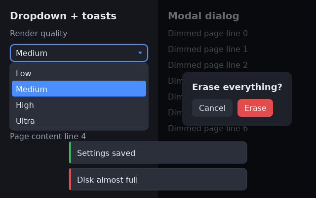

# fbui-widgets

The fbui widget toolkit: a **retained widget tree** with an Elm-ish
`update(msg) → state → damage → paint` loop, [taffy](https://github.com/DioxusLabs/taffy)
flexbox/grid layout, and a software-rendered widget set drawn through
`fbui-render`'s `Painter`. Headless by design — no device, no X11, no Wayland.

## The widgets

Every widget below is built and painted headlessly to a PNG by the
[`all_widgets`](examples/all_widgets.rs) example — no display hardware involved:



- **Label** — static text, with size/weight/color styling.
- **TextInput** — an editable single-line text field.
- **Checkbox** — a labelled boolean toggle.
- **Switch** — an animated on/off toggle.
- **Slider** — a draggable continuous range input.
- **ProgressBar** — a determinate progress indicator.
- **Button** — primary, `secondary()`, and `danger()` variants.
- **ImageView** — blits an RGBA `Image` (here a procedural gradient).
- **List** — a windowed list that renders only visible rows.
- **ScrollView** — a clipped, scrollable viewport.
- **Container** — the flexbox row/column layout primitive (padding, gap,
  alignment, grow, background).

A curated subset is also rendered by the [`gallery_png`](examples/gallery_png.rs)
example:



## The overlay layer

Everything that floats above the page builds on [`Stack`](src/widgets/stack.rs)
(z-ordered overlap) and the floating-overlay hooks (`Widget::overlay_rect` /
`paint_overlay`), rendered by the [`overlay_png`](examples/overlay_png.rs)
example:



- **Select** — a dropdown whose open menu floats over whatever is below the
  field (flipping above it when out of room), with keyboard navigation and
  click-away dismissal.
- **Dialog** — a modal scrim that centers its card, blocks input to the page,
  traps Tab focus inside its subtree, and dismisses on Esc / scrim click. Open
  it by adding it to a `Stack`; close it with `Ui::remove`.
- **Toasts** — a zero-size host that stacks transient notifications
  bottom-center; each fades out on the frame clock and disappears by itself.

## Regenerating the images

Both examples are pure-CPU and need no devices, so they run on any host:

```sh
# one of every widget
cargo run -p fbui-widgets --example all_widgets -- fbui-widgets/docs/assets/all_widgets.png

# the curated gallery
cargo run -p fbui-widgets --example gallery_png  -- fbui-widgets/docs/assets/gallery.png

# the overlay layer (dialog / select / toasts)
cargo run -p fbui-widgets --example overlay_png  -- fbui-widgets/docs/assets/overlay.png
```

Each takes an optional output path (defaulting to `all_widgets.png` /
`gallery.png` in the current directory).

## Where this fits

`fbui-widgets` is Phase 3 of [fbui](../PLAN.md). See
[`DESIGN.md`](DESIGN.md) for the retained-tree data model and the
update/damage/paint loop, and [`PHASE3.md`](PHASE3.md) for the phase's design
decisions and exit criteria.
